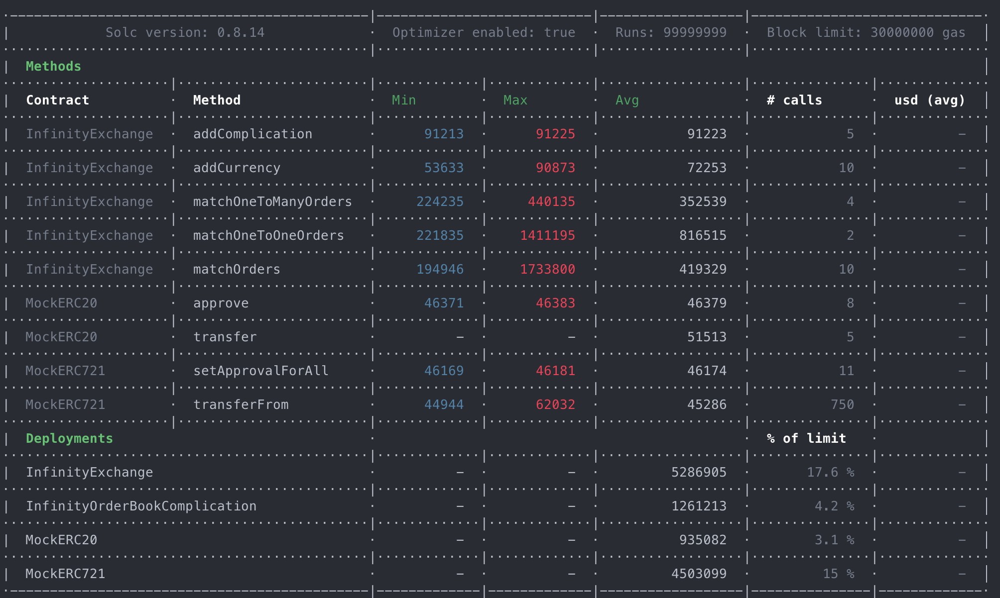
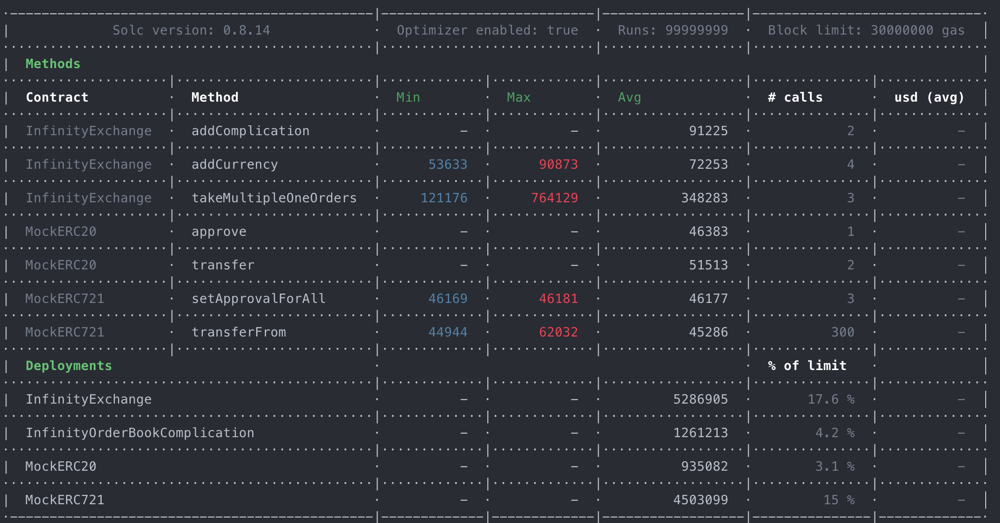

# Infinity NFT Marketplace contest details
- $47,500 USDC main award pot
- $2,500 USDC gas optimization award pot
- Join [C4 Discord](https://discord.gg/code4rena) to register
- Submit findings [using the C4 form](https://code4rena.com/contests/2022-06-infinity-contest/submit)
- [Read our guidelines for more details](https://docs.code4rena.com/roles/wardens)
- Starts June 14, 2022 20:00 UTC
- Ends June 19, 2022 19:59 UTC

This repo will be made public before the start of the contest. (C4 delete this line when made public)

# Infinity Exchange Contracts V2

These contracts will be used in production. They are gas optimized and a subset of our Certik audited [v1 contracts](https://github.com/infinitydotxyz/exchange-contracts-v1). These are also reviewed by an independent auditor that helped us patch a few vulnerabilities and helped us optimize them for gas efficiency. We tested a version of these contracts with ERC721 and ERC20 transfer functions written in assembly for gas optimization. We've found that the gains are not significant (esp when compared to gas savings offered by batching orders) and decided to favor code readability over these optimizations. We hope to write them in [Vyper](https://vyper.readthedocs.io/en/stable/) with the help of Vyper community in the future. Contributions welcome.

# Features

Together with our off chain sniping engine, the contracts support a host of features:

- Auto sniping
- Limit orders
- Dutch auctions and reverse dutch auctions
- Batched operations for a fluid UX and gas efficiency
  - Listings
  - Offers
  - Buys
  - Sells
  - Transfers
- Set based offers and listings like collection wide offers, multi collection wide offers, any collection offers and 'm of n' offers/listings
  - Example 1: User has a budget of 10 ETH. They wish to acquire any one NFT from either Goblintown, Moonbirds or Doodles. They can place an offer that specifies these criteria. As soon as a match is found from _any_ of these collections, order will be executed automatically.
  - Example 2: User has a budget of 10 ETH. They wish to acquire any one NFT from Goblintown NFTs with token ids 10, 20, 30, 40 and 50. They can place an offer that specifies these criteria. As soon as a match is found from _any_ of these token ids, order will be executed automatically.

# Modular architecture

Contracts are designed to be extensible. The main contract is `InfinityExchange.sol` which is used for taking approvals for spending NFTs and transaction currencies like `WETH`. It also has transfer functions that move assets between addresses. The contract is extensible via `Complications`. Complications are used to extend the functionality of the main contract to support different order types. We currently have one complication - `InfinityOrderBookComplication` that supports the order types above. More `complications` are in the works.

- [InfinityExchange.sol](./contracts/core/InfinityExchange.sol) - main contract that stores state and has user approvals for spending assets
- [InfinityOrderBookComplication.sol](./contracts/core/InfinityOrderBookComplication.sol) - our first complication that helps execute the order types listed above

# Staking and Token contracts

This repo also includes our Staking and Token contracts.

Staking contract allows people to stake Infinity tokens to earn voting power. Votes are needed to curate collections on the Infinity marketplace. Curation helps surface upcoming/prominent collections. All exchange fees generated from the trading activity of curated collections go to curators in proportion to how many votes they used to curate a collection. As an example: if Doodles was curated with a total of 100 votes (for a given time period) and a curator used 10 of his votes to curate it, they will get 10% of the trading fee for that time period.

Token contract defines the Infinity ($NFT) token. It comes with a timelock config that allows gradual supply increase overtime. There is a max supply of 1B tokens. Initial supply will be 250M. There are 3 inflation epochs, each with a time gap of 6 months. Each inflation epoch adds 250M tokens to the supply. After 1B max supply is reached there won't be any more supply unless the max number of epochs is increased. Any change to timelock config requires a thawing period of 30 days so that the community has enough time to be updated on any changes.

- [InfinityStaker.sol](./contracts/staking/InfinityStaker.sol)
- [InfinityToken.sol](./contracts/token/InfinityToken.sol)

# Gas costs

Our contracts are the most efficient NFT exchange contracts in the world. Users save upto 60% gas compared to Opensea and Looksrare. We achieve these gas savings via contract supported batch execution.

Match orders gas table (auto sniped by our matching engine):

Min gas is for autosniping single NFTs and max gas is for multiple NFTs (10 in the highest case). 

Take orders gas table (user initiated):

The min gas of 121176 units is for exchanging one NFT (33% less gas than Opensea). The max gas of 764129 is for exchanging a batch of 10 NFTs making the per NFT exchange gas cost a mere 76412.9 (60% less gas than performing 10 individual NFT exchanges on Opensea)

# Tests

The contracts have been extensively tested. All tests can be found in the `test` folder organized into different files. Tests can be run individually with `npx hardhat test --grep <test name>` or all at once with `./runTests.sh`

# Bug bounty

Coming soon.

# Links

[App](https://infinity.xyz)

[Twitter](https://twitter.com/infinitydotxyz)

[Discord](https://discord.gg/invite/infinitydotxyz)

[Github](https://github.com/infinitydotxyz)

[Medium](https://medium.com/@infinitydotxyz)

[Instagram](https://instagram.com/infinitydotxyz)
